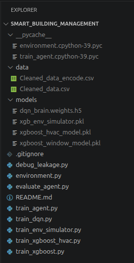

# HỆ THỐNG TRÍ TUỆ NHÂN TẠO QUẢN TRỊ MÔI TRƯỜNG VÀ NĂNG LƯỢNG TÒA NHÀ THÔNG MINH (XGB-DQN)

## MÔ TẢ DỰ ÁN

Dự án này tập trung nghiên cứu và triển khai hệ thống điều khiển phối hợp đa mục tiêu đối với hệ thống HVAC (Thông gió, điều hòa không khí) và trạng thái đóng/mở cửa sổ trong tòa nhà bằng mô hình kết hợp XGBoost và Học tăng cường sâu Deep Q-Network (XGB-DQN). Mục tiêu cốt lõi của hệ thống là tối ưu hóa đồng thời hai yếu tố xung đột: duy trì chất lượng tiện nghi nhiệt độ trong nhà ổn định theo tiêu chuẩn quốc tế ASHRAE 55, và cắt giảm tối đa mức độ tiêu thụ điện năng lãng phí của thiết bị làm mát. Trong kiến trúc này, thuật toán XGBoost đóng vai trò làm mô hình giả lập môi trường vật lý (Surrogate Environment) để dự đoán sự biến thiên nhiệt độ phòng dựa trên nhân quả hành động, trong khi mạng nơ-ron sâu DQN đóng vai trò tác tử điều khiển thông minh tự động rút ra chiến lược quản trị năng lượng tối ưu qua các mẫu kinh nghiệm lịch sử.

## YÊU CẦU HỆ THỐNG VÀ THƯ VIỆN PHỤ THUỘC

- Hệ điều hành khuyến nghị: Ubuntu 22.04 LTS
- Trình quản lý môi trường: Miniconda3 hoặc Anaconda3
- Ngôn ngữ lập trình: Python phiên bản 3.9

Các lệnh terminal dùng để khởi tạo môi trường ảo tách biệt và cài đặt toàn bộ các thư viện học máy phụ thuộc:

```
conda create --name smart_building python=3.9 -y
conda activate smart_building
pip install tensorflow xgboost scikit-learn pandas numpy matplotlib openpyxl
```

## HƯỚNG DẪN CÀI ĐẶT DỰ ÁN

Để thiết lập mã nguồn dự án trên máy tính cục bộ, người dùng thực hiện các thao tác tuần tự như sau:

Bước 1:
```
git clone https://github.com/hungmap0312/Smart_Building_Management.git
cd Smart_Building_Management
```

Bước 2:

Tải file dữ liệu data.zip tại đây: [Tải Data](https://drive.google.com/file/d/1g5D1cCQjDc3EZwcGBta7qHy_mhP-ydCs/view?usp=sharing "https://drive.google.com/file/d/1g5D1cCQjDc3EZwcGBta7qHy_mhP-ydCs/view?usp=sharing")

Bước 3:

Tải file trí tuệ nhân tạo models.zip tại đây: [Tải Models](https://drive.google.com/file/d/1mCZ1WJtRtAm3d-4gIb_2a_0xYUZ2ec0z/view?usp=drive_link "https://drive.google.com/file/d/1mCZ1WJtRtAm3d-4gIb_2a_0xYUZ2ec0z/view?usp=drive_link")

Bước 4:

Giải nén 2 file trên và chuyển các file bên trong lần lượt vào 2 thư mục data/ và models/.

## CẤU TRÚC THƯ MỤC DỰ ÁN SAU KHI CÀI ĐẶT



## HƯỚNG DẪN CHẠY CHƯƠNG TRÌNH

Quy trình thực thi và kiểm định hệ thống Trí tuệ nhân tạo được tiến hành thông qua 3 bước lệnh độc lập trên terminal:

Bước 1: Huấn luyện mô hình XGBoost đóng vai trò làm bộ giả lập môi trường vật lý để học quy luật thay đổi nhiệt độ phòng:

```
python train_env_simulator.py
```

Bước 2: Tiến hành vòng lặp huấn luyện chính cho mạng nơ-ron DQN tương tác với môi trường giả lập qua 500 kịch bản thời tiết, tối ưu hóa trọng số thần kinh và xuất biểu đồ tiến độ học tập:

```
python train_agent.py
```

Bước 3: Thực hiện kịch bản đánh giá kiểm định (Stress Test). Chương trình sẽ bốc thăm một ngày thời tiết ngẫu nhiên trong lịch sử, tắt tính năng thám hiểm ngẫu nhiên để AI vận hành bằng 100% trí khôn, sau đó xuất biểu đồ so sánh KPIs trực tiếp giữa AI và hành vi thực tế của con người:

```
python evaluate_agent.py
```

## NHÓM THỰC HIỆN

- Nguyễn Thanh Hải
- Nguyễn Hải Long
- Lê Tuấn Hưng
